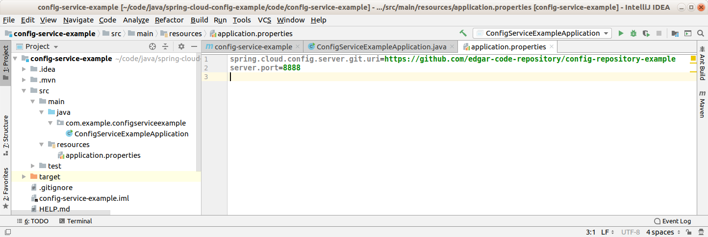

Config Service Example / Config Client Example
--------------------------------------------------------------------------------------------------------------------

Microservicios de ejemplo, desarrollados con Spring Boot y Spring Cloud, que actuan como servicio de configuración 
y servicio cliente del servicio de configuración.

El servicio de configuración levanta los datos de configuración desde un repositorio GIT:

https://github.com/edgar-code-repository/config-repository-example

--------------------------------------------------------------------------------------------------------------------

En el archivo application.properties del servicio de configuración se indica el puerto donde se levantará el 
servicio y la URL de Github desde donde se extraen datos de configuración:

--------------------------------------------------------------------------------------------------------------------

El servicio de configuración se levanta en el puerto 8888, y se observa que tiene datos de configuración disponibles 
para un servicio cuyo nombre es "config-client-example", el cual debe levantarse en el puerto 5551.
Además, se definen dos strings ("title", "message") a ser utilizados por la aplicación cliente:

--------------------------------------------------------------------------------------------------------------------

En el archivo bootstrap.properties de la aplicación cliente, se identifica el servicio y se registra la URL 
del servicio de configuración:

--------------------------------------------------------------------------------------------------------------------

La aplicación cliente se levanta en el puerto informado por el servicio de configuración, y el controller rest
a su vez, retorna los mensajes que obtuvo desde el servicio de configuración:

--------------------------------------------------------------------------------------------------------------------

Github repository:  https://github.com/edgar-code-repository/spring-cloud-config-example
