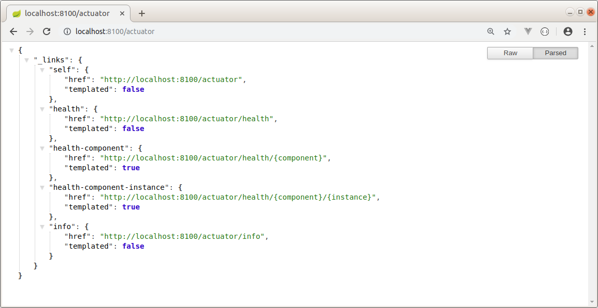
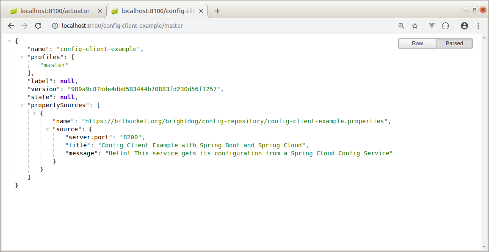
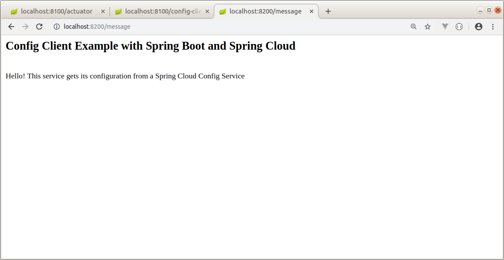

Config Service and Config Client Example
--------------------------------------------------------------------------------------------------------------------

Microservicios de ejemplo, desarrollados con Spring Boot y Spring Cloud, que levantan un servicio de configuración 
y un servicio que lee datos desde el servicio de configuración.

El servicio cliente utiliza la libreria Retry para reintentos de conexión
al servicio de configuración, si es que este no está disponible temporalmente.

El servicio de configuración levanta los datos desde un repositorio GIT:

https://github.com/edgar-code-repository/config-repository-example


--------------------------------------------------------------------------------------------------------------------

**Servicio de configuración:**

**Dependencias:**

```

  <dependency>
    <groupId>org.springframework.cloud</groupId>
    <artifactId>spring-cloud-config-server</artifactId>
  </dependency>

```

**Archivo de propiedades:**

En el archivo application.properties se indica que este servicio se levanta en el puerto 8100 y obtiene datos 
desde un repositorio git:

```

spring.cloud.config.server.git.uri=https://bitbucket.org/brightdog/config-repository
server.port=8100

```


**Anotaciones:**

La anotacion @EnableConfigServer permite que el servicio actue como un servicio de configuración:

```

@SpringBootApplication
@EnableConfigServer
public class ConfigServiceExampleApplication {

	public static void main(String[] args) {
		SpringApplication.run(ConfigServiceExampleApplication.class, args);
	}

}

```

**Ejecución:**

El servicio de configuración se levanta en el puerto 8100, y se observa que tiene endpoints disponibles bajo la url actuator:




**Datos de configuración disponibles para el servicio cliente:**

El servicio cliente debe levantarse en el puerto 8200.

Se definen dos strings ("title", "message") a ser utilizados por la aplicación cliente.



--------------------------------------------------------------------------------------------------------------------

**Servicio cliente:**

**Dependencias:**

Las siguientes dependencias permiten a la aplicación actuar como cliente del servicio de configuración
y utilizar la librería Retry para reintentar la conexión al servicio de configuración:

```
  <dependency>
    <groupId>org.springframework.cloud</groupId>
    <artifactId>spring-cloud-starter-config</artifactId>
  </dependency>

  <dependency>
    <groupId>org.springframework.boot</groupId>
    <artifactId>spring-boot-starter-aop</artifactId>
  </dependency>
  <dependency>
    <groupId>org.springframework.retry</groupId>
    <artifactId>spring-retry</artifactId>
  </dependency>  

```

**Archivo de propiedades:**

El nombre del archivo application.properties es modificado a bootstrap.properties.

En el archivo bootstrap.properties, se identifica el servicio y se registra la URL 
del servicio de configuración:

```

spring.application.name=config-client-example
spring.cloud.config.uri=${CLOUD_CONFIG_SERVER_URI:http://localhost:8100}

```

Se definen propiedades necesarias para que la aplicación ejecute reintentos de conexión
al servicio de configuración, si es que este no está disponible temporalmente:

```

spring.cloud.config.failFast=true
spring.cloud.config.retry.initialInterval=3000
spring.cloud.config.retry.multiplier=1.5
spring.cloud.config.retry.maxInterval=5000
spring.cloud.config.retry.maxAttempts=20

```

**Ejecución:**

La aplicación cliente se levanta en el puerto informado por el servicio de configuración, y el controller rest
a su vez, retorna los mensajes que obtuvo desde el servicio de configuración:




--------------------------------------------------------------------------------------------------------------------


