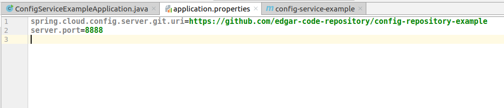
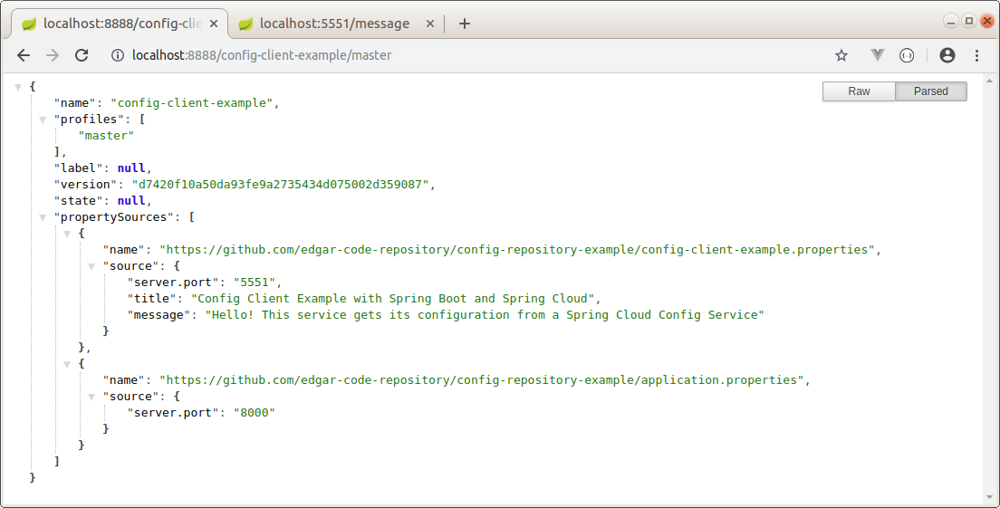
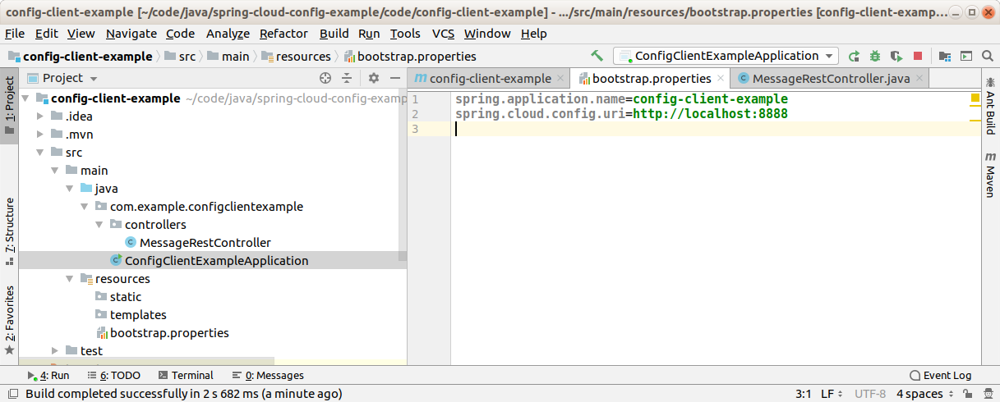
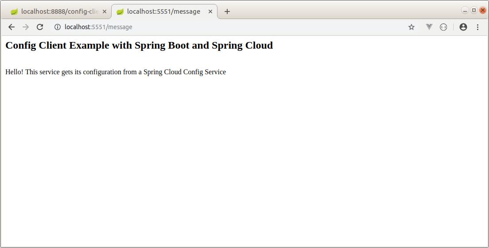

Config Service and Config Client Example
--------------------------------------------------------------------------------------------------------------------

Microservicios de ejemplo, desarrollados con Spring Boot y Spring Cloud, que levantan un servicio de configuracion 
y un servicio que lee datos desde el servicio de configuracion.

El servicio de configuracion levanta los datos desde un repositorio GIT:

https://github.com/edgar-code-repository/config-repository-example


--------------------------------------------------------------------------------------------------------------------

**Servicio de configuracion:**

**Dependencias:**

```

  <dependency>
    <groupId>org.springframework.cloud</groupId>
    <artifactId>spring-cloud-config-server</artifactId>
  </dependency>

```

**Archivo de propiedades:**

En el archivo application.properties se indica que este servicio se levanta en el puerto 8888 y obtiene datos 
desde un repositorio git:




**Anotaciones:**

La anotacion @EnableConfigServer permite que el servicio actue como un servicio de configuracion:

```

@SpringBootApplication
@EnableConfigServer
public class ConfigServiceExampleApplication {

	public static void main(String[] args) {
		SpringApplication.run(ConfigServiceExampleApplication.class, args);
	}

}

```

**Ejecucion:**

El servicio de configuracion se levanta en el puerto 8888, y se observa que tiene datos de disponibles 
para un servicio cuyo nombre es "config-client-example", el cual debe levantarse en el puerto 5551.
Ademas, se definen dos strings ("title", "message") a ser utilizados por la aplicacion cliente:



--------------------------------------------------------------------------------------------------------------------

**Servicio cliente:**

**Dependencias:**

La siguiente dependencia permite actuar como cliente del servicio de configuracion:

```
  <dependency>
    <groupId>org.springframework.cloud</groupId>
    <artifactId>spring-cloud-starter-config</artifactId>
  </dependency>

```

**Archivo de propiedades:**

El nombre del archivo application.properties es modificado a bootstrap.properties.

En el archivo bootstrap.properties, se identifica el servicio y se registra la URL 
del servicio de configuracion:



**Ejecucion:**

La aplicación cliente se levanta en el puerto informado por el servicio de configuración, y el controller rest
a su vez, retorna los mensajes que obtuvo desde el servicio de configuración:



--------------------------------------------------------------------------------------------------------------------


