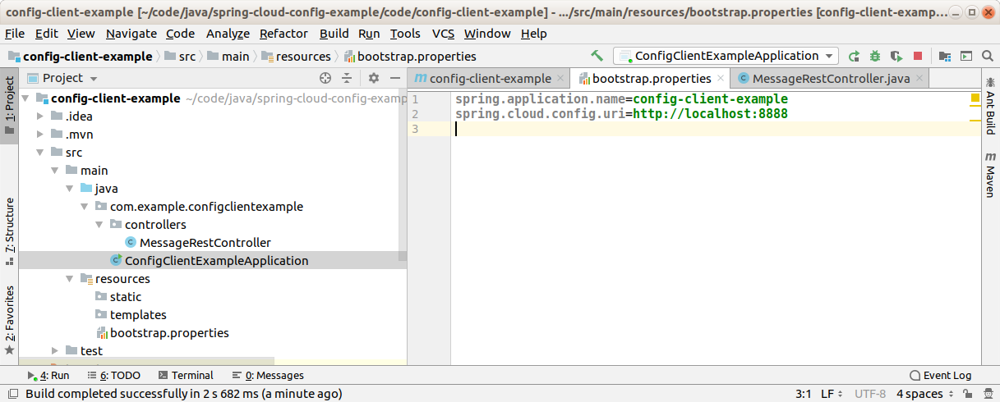

Config Client Example
--------------------------------------------------------------------------------------------------------------------

Microservicio de ejemplo, desarrollado con Spring Boot y Spring Cloud, que lee su configuración
desde un microservicio de configuración también desarrollado con Spring Cloud.

--------------------------------------------------------------------------------------------------------------------

En el archivo bootstrap.properties se identifica el servicio y se registra la URL del servicio de configuración:

--------------------------------------------------------------------------------------------------------------------

La aplicación se levanta en el puerto informado por el servicio de configuración, y el controller rest
a su vez, retorna los mensajes que obtuvo desde el servicio de configuración:

--------------------------------------------------------------------------------------------------------------------

Github repository:  https://github.com/edgar-code-repository/spring-cloud-config-example