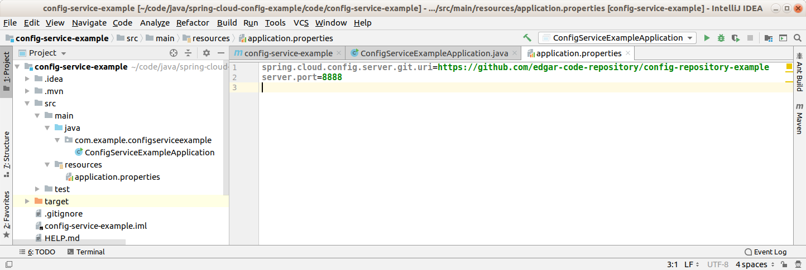
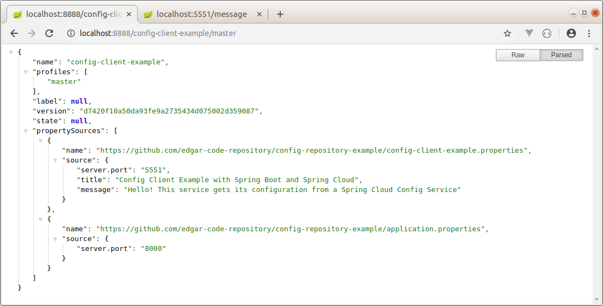

Config Service Example
--------------------------------------------------------------------------------------------------------------------

Microservicio de ejemplo, desarrollado con Spring Boot y Spring Cloud, que actúa como servicio de configuración,
levantado datos de configuración desde un repositorio GIT.

--------------------------------------------------------------------------------------------------------------------

En el archivo application.properties se indica el puerto donde se levantará el servicio y la URL de Github desde
donde se extraen datos de configuración:

--------------------------------------------------------------------------------------------------------------------

La aplicación se levanta en el puerto 8888, y se observa que tiene datos de configuración disponible para un
servicio cuyo nombre es "config-client-example", el cual debe levantarse en el puerto 5551:

--------------------------------------------------------------------------------------------------------------------

Github repository:  https://github.com/edgar-code-repository/spring-cloud-config-example